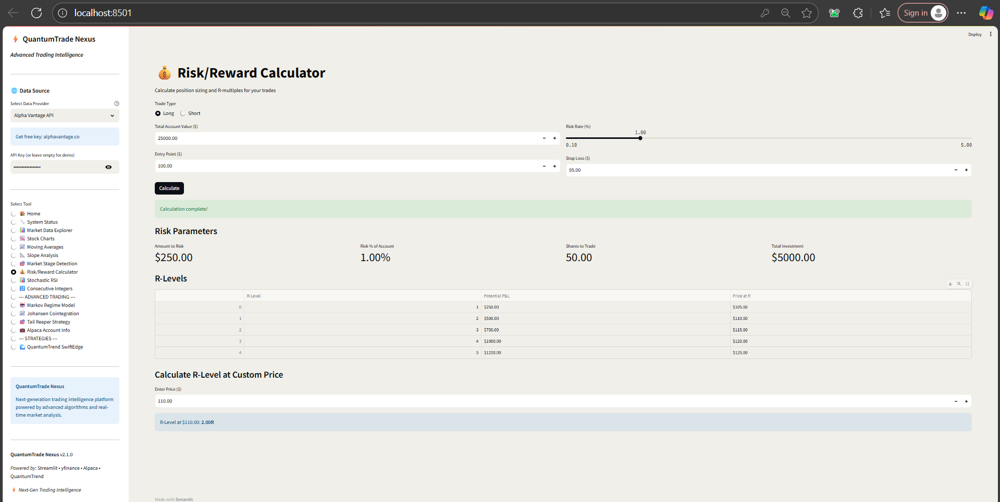

# ⚡ QuantumTrade Nexus

<div align="center">

**Advanced Trading Intelligence Platform**

A comprehensive, production-ready financial analysis toolkit combining technical analysis, algorithmic trading strategies, and real-time market intelligence.

[](https://github.com/vimal0156/QuantumTrade-Nexus)
[](https://www.python.org/)
[](https://streamlit.io/)
[](LICENSE)
[](https://github.com/vimal0156/QuantumTrade-Nexus/stargazers)

[Features](#-features) • [Quick Start](#-quick-start) • [Documentation](#-documentation) • [Architecture](#-architecture) • [Contributing](#-contributing)

</div>

---

## 📋 Table of Contents

- [Overview](#-overview)
- [Features](#-features)
- [Quick Start](#-quick-start)
- [Installation](#-installation)
- [Usage](#-usage)
- [Project Structure](#-project-structure)
- [Technical Analysis Tools](#-technical-analysis-tools)
- [Advanced Trading Strategies](#-advanced-trading-strategies)
- [Configuration](#-configuration)
- [API Integration](#-api-integration)
- [Development](#-development)
- [Testing](#-testing)
- [Deployment](#-deployment)
- [Troubleshooting](#-troubleshooting)
- [Contributing](#-contributing)
- [License](#-license)

---

## 🎯 Overview

**QuantumTrade Nexus** is an enterprise-grade trading intelligence platform that transforms complex financial analysis into an intuitive, interactive web application. Built with modern Python technologies, it combines multiple technical indicators, statistical models, and algorithmic trading strategies into a unified ecosystem.

### Key Highlights

- **🎨 Interactive Web Interface**: Built with Streamlit for seamless user experience
- **📊 Real-Time Market Data**: Integration with Yahoo Finance, Alpha Vantage, and Polygon.io
- **🤖 Advanced Algorithms**: Markov regime detection, Johansen cointegration, and proprietary strategies
- **📈 Comprehensive Analysis**: 15+ technical indicators and analysis tools
- **🔧 Modular Architecture**: Clean, maintainable, and extensible codebase
- **⚡ Production-Ready**: Robust error handling, caching, and performance optimization

---

## 📸 Screenshots & Live Application

### Home Dashboard


**QuantumTrade Nexus Home Page** - The main dashboard welcomes users with a clean, professional interface displaying all available tools and features. The sidebar shows the complete navigation menu with 15+ trading tools, including basic technical analysis, advanced strategies, and system utilities. The home page provides a comprehensive overview of available tools categorized into Market Data Tools, Technical Analysis, Trading Tools, Advanced Trading Intelligence, and Utilities sections. Users can see real-time status indicators showing 15 active tools and online data connectivity.

---

### System Status & Backend Verification


**System Status Dashboard** - This comprehensive system health check page displays the module import status, functional tests, and backend usage map. All 24 backend modules are successfully loaded (shown in green checkmarks), including core libraries like pandas, numpy, yfinance, and specialized modules for trading strategies. The functional tests section validates data fetching and calculation capabilities, while the backend usage map shows which scripts utilize specific modules, ensuring complete system integration and reliability.


**Detailed Module Status** - Extended view of the system status showing all imported modules with their locations and versions. This includes data fetching utilities, technical indicators, risk calculators, stage detectors, and advanced strategy wrappers. The backend architecture section provides transparency into how different components interact, listing all scripts and their dependencies for troubleshooting and maintenance purposes.

---

### Market Data Explorer


**Market Data Explorer Interface** - The Market Data Explorer allows users to fetch and analyze historical market data for any ticker symbol. In this example, AAPL (Apple Inc.) data is being fetched for a 90-day period. The interface shows the data structure with shape information (90 rows × 6 columns) and date range (2024-10-22 to 2025-01-22). The market data table displays complete OHLCV (Open, High, Low, Close, Volume) information with precise timestamps and values, providing traders with comprehensive historical data for analysis.


**AAPL Closing Price Visualization** - A clean line chart displaying Apple's closing price over the selected period. The chart shows significant price movements from around $220 to $260, with clear visualization of the downtrend in early 2025 (dropping to ~$175) followed by a strong recovery. Summary statistics are displayed below showing current price ($262.24), recent change ($25.76 or +10.88%), and high ($264.38) and low ($169.21) values for the period.


**Professional Candlestick Chart** - Advanced financial charting using mplfinance library displaying AAPL's price action with candlestick patterns and volume bars. Green candles indicate bullish days (close > open) while red candles show bearish days. The volume panel at the bottom provides insight into trading activity, with color-coded bars matching the price movement direction. This professional-grade chart helps traders identify patterns, support/resistance levels, and market sentiment.

---

### Moving Averages Analysis


**Moving Average Configuration** - The Moving Averages tool allows users to analyze trends across multiple timeframes. This interface shows AAPL configured for daily timeframe analysis with 50-day and 200-day moving averages. The chart displays the classic "Golden Cross" and "Death Cross" patterns where the fast MA (50-day, blue line) crosses above or below the slow MA (200-day, red line), providing critical trend reversal signals for traders.


**Moving Average Data Table** - Detailed tabular view of the moving average calculations showing historical price data alongside computed 50MA and 200MA values. The table includes dates, OHLC prices, and calculated moving average values, allowing traders to perform detailed analysis and backtesting. The chart above shows the relationship between price and moving averages over time, highlighting trend changes and potential entry/exit points.

---

### Slope Analysis


**Linear Regression Slope Analysis** - This tool performs linear regression on price data to calculate trend strength and direction. The purple trend line overlaid on the candlestick chart represents the linear regression fit, showing AAPL's overall upward trajectory. The slope value helps quantify trend strength, with positive values indicating uptrends and negative values indicating downtrends.


**Slope Metrics Display** - Detailed slope analysis results showing a slope value of 0.8095, indicating a strong uptrend. The trend classification displays "Strong Uptrend" in green, providing traders with clear, actionable information. The visualization combines the regression line with price action, making it easy to identify when price deviates significantly from the trend line, potentially signaling overbought or oversold conditions.

---

### Market Stage Detection


**Stan Weinstein's Market Stage Analysis** - Implementation of the renowned 4-stage market cycle theory. The chart displays AAPL's price action with color-coded background regions representing different market stages: Stage 1 (Accumulation/Basing - light green), Stage 2 (Advancing/Uptrend - green), Stage 3 (Distribution/Topping - purple), and Stage 4 (Declining/Downtrend - red). The 30-week moving average (brown line) serves as the stage determination baseline. The detected stages summary shows the count of periods in each stage, helping traders align their strategies with current market conditions.


**Customizable Stage Detection** - Users can fine-tune stage detection parameters including Fast MA period, Slow MA period, and MA Comparison threshold. The interface provides real-time stage detection with clear labeling of each stage period. This tool is invaluable for swing traders and position traders who base their strategies on market cycle phases, allowing them to buy in Stage 1, hold through Stage 2, sell in Stage 3, and avoid Stage 4.

---

### Risk/Reward Calculator



**Professional Position Sizing Tool** - The Risk/Reward Calculator helps traders determine optimal position sizes based on account value, risk tolerance, and trade setup. In this example, with a $250 account value, 1% risk tolerance, entry at $50, and stop loss at $45, the calculator determines a position size of $5000. The R-Levels table displays profit targets at 1R through 5R multiples, showing potential profit amounts at each level. The custom R-level calculator allows traders to determine what price level corresponds to any R-multiple, essential for planning exits and managing trades.

---

### Stochastic RSI Indicator


**TradingView-Compatible Stochastic RSI** - This momentum indicator combines RSI with stochastic oscillator principles to identify overbought and oversold conditions. The interface allows customization of RSI Period, Stochastic Length, K Smoothing, and D Smoothing parameters. The chart displays both the price action with 50MA overlay and the Stochastic RSI oscillator below, with overbought (>0.80) and oversold (<0.20) threshold lines marked.


**Stochastic RSI Signal Analysis** - Detailed view showing the K-line (blue) and D-line (orange) oscillating between 0 and 1. The current reading shows K at 0.5081 and D at 0.5538 with a "Neutral" signal. Traders use crossovers of the K and D lines, along with overbought/oversold levels, to time entries and exits. The oscillator helps identify potential reversals before they appear in price action, providing early warning signals.

---

### Consecutive Integer Groups


**Pattern Detection Utility** - This specialized tool identifies consecutive integer sequences in arrays, useful for detecting consecutive trading days, pattern recognition, and data analysis. The interface accepts custom integer arrays and minimum group size parameters. The visualization displays identified groups with color-coding, making it easy to spot patterns and sequences.


**Consecutive Groups Results** - The results section lists all detected consecutive integer groups with their ranges and lengths. The scatter plot visualization shows each group in a different color along a number line, making pattern identification intuitive. This tool is particularly useful for analyzing consecutive winning/losing days, identifying data gaps, and pattern-based strategy development.

---

### Markov Regime Switching Model


**Hidden Markov Model for Market Regimes** - Advanced statistical model that identifies different market regimes (bull, bear, sideways) using Hidden Markov Models. The interface shows AAPL analysis with a lookback period of 252 days. The current market regime is identified as "Bear Market" with 98.3% confidence and 1.7% exit probability. This high-confidence regime detection helps traders adjust their strategies based on prevailing market conditions.


**Regime Probability Timeline** - The chart displays the probability of being in Regime 0 (blue) or Regime 1 (orange) over time, with a high confidence threshold line (red dashed). The probabilities oscillate between 0 and 1, showing clear regime switches throughout the analysis period. This visualization helps traders understand regime stability and anticipate potential regime changes, crucial for adaptive trading strategies.


**Price Action with Regime Context** - Combined visualization showing AAPL's closing price in the upper panel and regime probabilities in the lower panel. The regime probability area chart uses green shading for Bull Regime and red shading for Bear Regime, making it easy to correlate price movements with identified regimes. This integrated view helps traders understand how price behavior differs across regimes.


**Detailed Regime Analysis** - Comprehensive statistical output showing regime transition probabilities, mean returns, volatility, and other key metrics for each regime. The summary includes regime-specific parameters that help traders understand the characteristics of each market state. This information is crucial for developing regime-dependent trading strategies and risk management protocols.

---

### Johansen Cointegration Test


**Pairs Trading Statistical Analysis** - The Johansen Cointegration Test identifies statistically cointegrated asset pairs suitable for pairs trading strategies. Users can input multiple ticker symbols (AAPL, MSFT, GOOG in this example) and set a lookback period. The test results table shows trace statistics, critical values at different confidence levels (90%, 95%, 99%), and whether cointegration is detected at each level.


**Cointegration Visualization** - Normalized price series chart displaying the relative performance of tested assets over time. When assets are cointegrated, their normalized prices tend to move together despite short-term divergences. The chart shows AAPL (blue), MSFT (orange), and GOOG (green) normalized to base 100, making it easy to identify periods of divergence and convergence that present trading opportunities.


**Detailed Cointegration Analysis** - Extended view showing the complete cointegration test results with statistical significance levels and cointegration vectors. The summary table at the bottom displays the cointegration status for each tested pair, helping traders identify the strongest cointegrated relationships for pairs trading strategies.

---

### Tail Reaper Mean Reversion Strategy


**Volatility-Based Mean Reversion** - The Tail Reaper strategy identifies extreme price movements (tails) and trades mean reversion. The interface allows configuration of strategy parameters including lookback period, Z-score threshold, and risk management settings. Current signal analysis shows entry price, stop loss, R-multiple, and signal direction (NEUTRAL in this case). The strategy combines price action with a 20-day moving average to identify trading opportunities.


**Z-Score Analysis Chart** - Dual-panel visualization showing AAPL price with 20-day MA in the upper panel and Z-Score (mean reversion indicator) in the lower panel. The Z-Score oscillates around zero, with values above +2.0 (red zone) indicating overbought conditions and values below -2.0 (green zone) indicating oversold conditions. The strategy generates signals when price reaches extreme Z-Score levels and begins reverting to the mean.


**Tail Reaper Strategy Overview** - Detailed explanation of the strategy methodology, including entry rules (Z-Score thresholds), exit rules (opposite Z-Score signals or profit targets), and risk management protocols (stop loss placement and position sizing). The strategy is designed to capture profits from extreme price movements that statistically tend to revert to the mean.

---

### Alpaca Trading Account Integration


**Live Trading Account Connection** - Integration with Alpaca Markets for paper and live trading. The interface allows users to input their Alpaca API credentials securely. Once connected, traders can view account information, manage positions, and execute trades directly from the platform. Links to Alpaca documentation and API key generation are provided for easy setup.

---

### Trading Strategies Hub


**Professional Strategy Implementations** - The Trading Strategies section provides access to advanced, professionally-developed trading strategies. Currently featuring the QuantumTrend SwiftEdge strategy, this hub will expand to include additional algorithmic trading systems. Each strategy includes detailed documentation, backtesting capabilities, and live trading integration.

---

### QuantumTrend SwiftEdge Strategy


**Adaptive Trend-Following System** - The flagship QuantumTrend SwiftEdge strategy combines multiple technical indicators for precision trend following. The strategy configuration panel allows users to select tickers, set lookback periods, and enable/disable live trading. Backtest results show impressive performance metrics: 24.41% total return, 6.28% annualized return, and 1.59 Sharpe ratio. Trading statistics display 3 total trades, 3 winning trades, 0 losing trades, and 66.7% win rate with $12,441 total profit. The current signal shows a BUY recommendation for a Long position in an Uptrend.


**QuantumTrend Signal Chart** - Comprehensive visualization showing AAPL price action with the QuantumTrend SwiftEdge strategy signals. The chart displays: close price (black line), supertrend bands (blue shaded area indicating trend direction), Keltner Channel (upper and lower bounds in orange and teal), 200-period EMA (yellow line for long-term trend), and buy/sell signals (green upward arrows for buy, red downward arrows for sell). The strategy successfully identifies major trend changes and provides clear entry/exit signals.


**Strategy Performance Analysis** - Dual-panel performance visualization showing equity curve comparison in the upper panel and strategy drawdown in the lower panel. The blue line represents the strategy's equity growth from $10,000 to over $12,000, while the gray line shows buy-and-hold performance. The strategy significantly outperforms buy-and-hold during the analysis period. The drawdown chart (red shaded area) shows the strategy's risk profile, with maximum drawdown periods clearly visible, helping traders understand the strategy's risk characteristics.


**Detailed Drawdown Analysis** - Extended view of the strategy drawdown chart with accompanying trade log table. The drawdown visualization shows periods of equity decline from peak values, essential for understanding risk and setting appropriate position sizes. The trade log displays individual trade details including entry/exit dates, prices, position types (BUY/SELL), and profit/loss for each trade, providing complete transparency into strategy performance.

---

## ✨ Features

### Core Technical Analysis

- **Market Data Explorer**: Multi-ticker data fetching with customizable intervals
- **Advanced Charting**: Candlestick, OHLC, and line charts with mplfinance
- **Moving Averages**: Daily, weekly, and monthly timeframe analysis
- **Slope Analysis**: Linear regression-based trend identification
- **Market Stage Detection**: Stan Weinstein's 4-stage market cycle implementation
- **Stochastic RSI**: TradingView-compatible momentum indicator
- **Risk/Reward Calculator**: Position sizing and R-multiple analysis

### Advanced Trading Intelligence

- **🤖 Markov Regime Model**: Hidden Markov Model for market regime detection
- **📈 Johansen Cointegration**: Statistical arbitrage and pairs trading analysis
- **🎯 Tail Reaper Strategy**: Volatility-based momentum trading system
- **🌊 QuantumTrend SwiftEdge**: Proprietary multi-timeframe trend following strategy
- **💼 Alpaca Integration**: Live trading account management and execution

### Data Sources

- **Yahoo Finance**: Free, unlimited historical and real-time data
- **Alpha Vantage**: Professional-grade API with extended coverage
- **Polygon.io**: High-frequency data for advanced analysis

---

## 🚀 Quick Start

### Prerequisites

- Python 3.8 or higher
- pip package manager
- Internet connection for market data

### Installation

```bash
# Clone the repository
git clone https://github.com/vimal0156/QuantumTrade-Nexus.git
cd QuantumTrade-Nexus

# Install dependencies
pip install -r requirements.txt
```

### Running the Application

**Option 1: Using the batch file (Windows)**
```bash
run_app.bat
```

**Option 2: Using Streamlit directly**
```bash
streamlit run streamlit_app.py
```

**Option 3: Using Python module**
```bash
python -m streamlit run streamlit_app.py
```

The application will automatically open in your default browser at `http://localhost:8501`

---

## 📦 Installation

### Standard Installation

```bash
pip install -r requirements.txt
```

### Development Installation

```bash
# Install with development dependencies
pip install -r requirements.txt

# Install in editable mode for development
pip install -e .
```

### Dependencies

**Core Libraries:**
- `streamlit>=1.28.0` - Web application framework
- `pandas>=2.0.0` - Data manipulation and analysis
- `numpy>=1.24.0` - Numerical computing
- `yfinance>=0.2.28` - Market data fetching

**Technical Analysis:**
- `matplotlib>=3.7.0` - Plotting and visualization
- `mplfinance>=0.12.9b7` - Financial charting
- `scipy>=1.11.0` - Scientific computing
- `seaborn>=0.12.0` - Statistical visualization

**Advanced Features:**
- `statsmodels>=0.14.0` - Statistical models (Markov, Johansen)
- `alpaca-py>=0.20.0` - Alpaca trading API
- `asyncpg>=0.29.0` - PostgreSQL async driver
- `pyyaml>=6.0` - Configuration management
- `pytz>=2023.3` - Timezone handling

---

## 💻 Usage

### Basic Workflow

1. **Launch the application** using one of the methods above
2. **Select a data source** from the sidebar (Yahoo Finance, Alpha Vantage, or Polygon.io)
3. **Choose a tool** from the navigation menu
4. **Configure parameters** using the interactive controls
5. **Analyze results** through charts, tables, and metrics

### Example: Analyzing a Stock

```python
# Navigate to "Stock Charts"
# Enter ticker: AAPL
# Select timeframe: 90 days
# Click "Generate Chart"
```

### Example: Risk Management

```python
# Navigate to "Risk/Reward Calculator"
# Account Value: $25,000
# Entry Price: $150.00
# Stop Loss: $145.00
# Target: $160.00
# Click "Calculate Position Size"
```

### Example: Strategy Analysis

```python
# Navigate to "QuantumTrend SwiftEdge"
# Enter ticker: SPY
# Select timeframe: 1 year
# Click "Run Analysis"
# Review signals and performance metrics
```

---

## 📁 Project Structure

```
QuantumTrade Nexus/
│
├── streamlit_app.py              # Main application entry point
├── dashboard.py                  # Dashboard implementation
├── db.py                         # Database utilities
├── config_loader.py              # Configuration management
├── requirements.txt              # Python dependencies
├── runtime.txt                   # Python version specification
├── run_app.bat                   # Windows launcher script
│
├── utils/                        # Core utility modules
│   ├── __init__.py
│   ├── data_fetcher.py          # Market data fetching
│   ├── unified_data_fetcher.py  # Multi-source data aggregation
│   ├── indicators.py            # Technical indicators
│   ├── risk_calculator.py       # Risk management calculations
│   ├── stage_detector.py        # Market stage detection
│   ├── consecutive_integers.py  # Pattern detection utilities
│   └── scripts_wrapper.py       # Advanced strategy wrappers
│
├── strategy/                     # Trading strategies
│   ├── __init__.py
│   ├── quantumtrend_swiftedge.py    # QuantumTrend strategy core
│   ├── streamlit_quantumtrend.py    # Strategy UI integration
│   ├── test_quantumtrend.py         # Strategy unit tests
│   └── README.md                     # Strategy documentation
│
├── scripts/                      # Advanced trading scripts
│   ├── markov.py                # Markov regime detection
│   ├── johansencoint.py         # Johansen cointegration
│   ├── johansentrader.py        # Cointegration trading bot
│   ├── tailreaper.py            # Tail Reaper strategy
│   ├── account_info.py          # Alpaca account management
│   ├── cancelopenorders.py      # Order management
│   └── msv11.py                 # Market scanner v11
│
├── docs/                         # Documentation
│   ├── QUICKSTART.md            # Quick start guide
│   ├── README_STREAMLIT.md      # Streamlit app documentation
│   ├── APP_OVERVIEW.md          # Application overview
│   ├── INTEGRATION_GUIDE.md     # Integration documentation
│   └── API_KEY_USAGE.md         # API configuration guide
│
└── [Original Notebooks]/        # Source Jupyter notebooks
    ├── yfinance-market-data/
    ├── plotting-stock-charts-mplfinance/
    ├── computing-simple-moving-averages/
    ├── compute-slope-series/
    ├── market-stage-detection/
    ├── risk-reward-calculator/
    ├── trading-view-stochastic-rsi/
    └── consecutive-integer-groups/
```

---

## 📊 Technical Analysis Tools

### 1. Market Data Explorer
Fetch and visualize historical market data for single or multiple tickers with customizable intervals (daily, weekly, monthly).

**Features:**
- Multi-ticker comparison
- Adjustable date ranges
- Export capabilities
- Real-time data updates

### 2. Stock Charts
Professional-grade financial charts using mplfinance with multiple chart types.

**Chart Types:**
- Candlestick
- OHLC (Open-High-Low-Close)
- Line charts
- Volume overlays

### 3. Moving Averages
Calculate and visualize simple moving averages across multiple timeframes.

**Timeframes:**
- Daily: 50/200 MA
- Weekly: 10/40 MA
- Monthly: 10 MA

### 4. Slope Analysis
Linear regression-based trend strength calculation with visual overlays.

**Metrics:**
- Slope coefficient
- R-squared value
- Trend classification
- Confidence intervals

### 5. Market Stage Detection
Implementation of Stan Weinstein's 4-stage market cycle theory.

**Stages:**
- Stage 1: Accumulation (Basing)
- Stage 2: Advancing (Uptrend)
- Stage 3: Distribution (Topping)
- Stage 4: Declining (Downtrend)

### 6. Stochastic RSI
TradingView-compatible Stochastic RSI implementation for momentum analysis.

**Parameters:**
- RSI Length: 14
- Stochastic Length: 14
- K Smoothing: 3
- D Smoothing: 3

### 7. Risk/Reward Calculator
Professional position sizing and risk management tool.

**Calculations:**
- Position size based on risk percentage
- R-multiple targets (1R to 5R)
- Stop loss placement
- Profit targets

---

## 🤖 Advanced Trading Strategies

### Markov Regime Model
Hidden Markov Model for detecting market regimes (bull, bear, sideways).

**Applications:**
- Regime-based strategy switching
- Risk adjustment
- Portfolio allocation

### Johansen Cointegration
Statistical test for identifying cointegrated pairs for pairs trading.

**Features:**
- Multi-asset cointegration testing
- Spread calculation
- Mean reversion signals

### Tail Reaper Strategy
Volatility-based momentum strategy that captures extreme price movements.

**Components:**
- ATR-based volatility filtering
- Momentum confirmation
- Dynamic position sizing

### QuantumTrend SwiftEdge
Proprietary multi-timeframe trend following strategy combining multiple indicators.

**Indicators:**
- Moving average crossovers
- Slope analysis
- Volume confirmation
- Market stage filtering

---

## ⚙️ Configuration

### Data Source Configuration

Configure your preferred data source in the sidebar:

**Yahoo Finance (Default)**
- No API key required
- Free, unlimited access
- Delayed data (15-20 minutes)

**Alpha Vantage**
```python
# Get free API key from: https://www.alphavantage.co/support/#api-key
# Enter in sidebar or set environment variable
export ALPHA_VANTAGE_API_KEY="your_key_here"
```

**Polygon.io**
```python
# Get API key from: https://polygon.io/
# Enter in sidebar or set environment variable
export POLYGON_API_KEY="your_key_here"
```

### Alpaca Trading Configuration

For live trading features, configure Alpaca credentials:

```yaml
# config.yaml
alpaca:
  api_key: "your_api_key"
  secret_key: "your_secret_key"
  base_url: "https://paper-api.alpaca.markets"  # Paper trading
  # base_url: "https://api.alpaca.markets"      # Live trading
```

### Database Configuration

For Markov model persistence:

```yaml
# config.yaml
database:
  host: "localhost"
  port: 5432
  database: "trading_db"
  user: "your_username"
  password: "your_password"
```

---

## 🔌 API Integration

### Supported Data Providers

| Provider | Type | Cost | Rate Limit | Real-time |
|----------|------|------|------------|-----------|
| Yahoo Finance | REST | Free | Unlimited | Delayed |
| Alpha Vantage | REST | Free/Paid | 5/min (free) | Yes (paid) |
| Polygon.io | REST/WebSocket | Free/Paid | 5/min (free) | Yes (paid) |

### Broker Integration

| Broker | Status | Features |
|--------|--------|----------|
| Alpaca | ✅ Supported | Paper/Live trading, Account info, Orders |
| Interactive Brokers | 🔄 Planned | Full API integration |
| TD Ameritrade | 🔄 Planned | Market data, Trading |

---

## 🛠️ Development

### Setting Up Development Environment

```bash
# Clone repository
git clone https://github.com/vimal0156/QuantumTrade-Nexus.git
cd QuantumTrade-Nexus

# Create virtual environment
python -m venv venv
source venv/bin/activate  # On Windows: venv\Scripts\activate

# Install dependencies
pip install -r requirements.txt

# Run tests
python -m pytest tests/

# Run application in development mode
streamlit run streamlit_app.py --server.runOnSave true
```

### Code Style

This project follows PEP 8 style guidelines:

```bash
# Format code
black .

# Check style
flake8 .

# Type checking
mypy .
```

### Adding New Features

1. Create feature branch: `git checkout -b feature/your-feature`
2. Implement changes in appropriate module
3. Add tests in `tests/` directory
4. Update documentation
5. Submit pull request

---

## 🧪 Testing

### Running Tests

```bash
# Run all tests
python -m pytest

# Run specific test file
python -m pytest tests/test_indicators.py

# Run with coverage
python -m pytest --cov=utils --cov=strategy
```

### Test Structure

```
tests/
├── test_data_fetcher.py      # Data fetching tests
├── test_indicators.py         # Indicator calculation tests
├── test_risk_calculator.py    # Risk management tests
├── test_stage_detector.py     # Stage detection tests
└── test_quantumtrend.py       # Strategy tests
```

---

## 🚀 Deployment

### Streamlit Cloud

1. Push code to GitHub
2. Visit [share.streamlit.io](https://share.streamlit.io)
3. Connect repository
4. Configure secrets in dashboard
5. Deploy

### Docker Deployment

```dockerfile
# Dockerfile
FROM python:3.9-slim

WORKDIR /app
COPY requirements.txt .
RUN pip install -r requirements.txt

COPY . .

EXPOSE 8501

CMD ["streamlit", "run", "streamlit_app.py", "--server.port=8501", "--server.address=0.0.0.0"]
```

```bash
# Build and run
docker build -t quantumtrade-nexus .
docker run -p 8501:8501 quantumtrade-nexus
```

### Heroku Deployment

```bash
# Create Procfile
echo "web: streamlit run streamlit_app.py --server.port=$PORT --server.address=0.0.0.0" > Procfile

# Deploy
heroku create quantumtrade-nexus
git push heroku main
```

---

## 🔧 Troubleshooting

### Common Issues

**Module Not Found Error**
```bash
pip install -r requirements.txt
```

**Port Already in Use**
```bash
streamlit run streamlit_app.py --server.port 8502
```

**Data Fetching Errors**
- Check internet connection
- Verify API keys are correct
- Check rate limits
- Try alternative data source

**Performance Issues**
- Reduce date range for analysis
- Use data caching
- Close unused browser tabs
- Restart application

### Getting Help

- 📖 Check [documentation](docs/)
- 🐛 Report bugs via [GitHub Issues](https://github.com/vimal0156/QuantumTrade-Nexus/issues)
- 💬 Join our community
- 📧 Email: support@quantumtradenexus.com

---

## 🤝 Contributing

We welcome contributions! Please follow these guidelines:

### How to Contribute

1. Fork the repository
2. Create feature branch (`git checkout -b feature/AmazingFeature`)
3. Commit changes (`git commit -m 'Add AmazingFeature'`)
4. Push to branch (`git push origin feature/AmazingFeature`)
5. Open Pull Request

### Contribution Guidelines

- Follow PEP 8 style guide
- Add tests for new features
- Update documentation
- Ensure all tests pass
- Write clear commit messages

### Areas for Contribution

- 🐛 Bug fixes
- ✨ New technical indicators
- 📊 Additional chart types
- 🤖 Trading strategies
- 📚 Documentation improvements
- 🌐 Internationalization
- ⚡ Performance optimization

---

## 📄 License

This project is licensed under the **GNU Affero General Public License v3.0 (AGPL-3.0)** - see the [LICENSE](LICENSE) file for details.

### Key Points

- ✅ **Free to use, modify, and distribute**
- ✅ **Open source** - source code must remain open
- ✅ **Network use** - If you run this on a server, you must provide source code to users
- ✅ **Copyleft** - Derivative works must use the same license

For more information, visit: [GNU AGPL v3.0](https://www.gnu.org/licenses/agpl-3.0.en.html)

---

## 🙏 Acknowledgments

- **Stan Weinstein** - Market Stage Analysis methodology
- **TradingView** - Stochastic RSI implementation reference
- **Streamlit Team** - Excellent web framework
- **yfinance Contributors** - Market data access
- **Open Source Community** - Various libraries and tools

---

## 📞 Contact

**Project Repository**: [github.com/vimal0156/QuantumTrade-Nexus](https://github.com/vimal0156/QuantumTrade-Nexus)

- 🌐 GitHub: [vimal0156/QuantumTrade-Nexus](https://github.com/vimal0156/QuantumTrade-Nexus)
- 📧 Email: contact@quantumtradenexus.com
- ⭐ Star the repo if you find it useful!

---

## 📈 Project Status


**Current Version**: 1.0.0  
**Status**: Active Development  
**Last Updated**: October 2025

---

<div align="center">

**⚡ Built with passion for traders, by traders ⚡**

[⬆ Back to Top](#-quantumtrade-nexus)

</div>